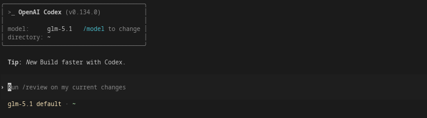

<div align="center">



# codex-proxy

**[Codex CLI](https://github.com/openai/codex)'ı herhangi bir OpenAI-uyumlu API sağlayıcısıyla kullanın.**

OpenAI hesabı gerekmez. Fork gerekmez. Codex güncellemelerini almaya devam edin.

[](LICENSE)
[](https://www.npmjs.com/package/codex-anywhere-proxy)

</div>

---

## Nasıl çalışır?

```
Codex CLI  ──Responses API──▸  codex-proxy  ──chat/completions──▸  Sağlayıcınız
```

Codex CLI, OpenAI **Responses API** formatını kullanır — bunu yerel olarak yalnızca OpenAI sunar.
Bu hafif proxy, Responses API ↔ chat/completions arasında gerçek zamanlı çeviri yapar
ve Codex'ü OpenAI API formatını konuşan herhangi bir sağlayıcıyla kullanmanıza olanak tanır.

## Özellikler

- **Herhangi bir sağlayıcı** — OpenAI chat/completions API uyumlu her sağlayıcıyla çalışır
- **İnteraktif kurulum** — `codex-proxy install` sağlayıcı, API anahtarı ve model seçiminde size rehberlik eder
- **Sağlayıcıya göre model kataloğu** — Sağlayıcınızı otomatik algılar ve sadece onun modellerini gösterir
- **CLI yönetimi** — `start`, `stop`, `restart`, `status`, `config`, `models`, `logs` komutları
- **Streaming** — Gerçek zamanlı token çıktısıyla tam SSE streaming desteği
- **Tool çağrıları** — Function, custom (apply_patch) ve namespace (MCP) tool desteği
- **Sub-agent desteği** — Codex sub-agent'ları proxy üzerinden çalışır
- **Bağlam takibi** — Kullanım verileri Codex'e iletilir, yerleşik bağlam takibi ve auto-compaction için
- **Çapraz platform** — Linux, macOS, Windows

## Gereksinimler

- [Node.js](https://nodejs.org) 18+ (CLI için, çoğu sistemde yüklüdür)
- [Bun](https://bun.sh) runtime (yoksa CLI tarafından otomatik kurulur)
- [Codex CLI](https://github.com/openai/codex) v0.134+

## Hızlı başlangıç

```bash
npm i -g codex-anywhere-proxy
codex-proxy install
```

Bu kadar. CLI şunları yapar:

1. Bun'u kontrol eder/yükler
2. Hangi sağlayıcıyı kullandığınızı sorar (Z.AI, DeepSeek, OpenAI, OpenRouter, Ollama vb.)
3. API anahtarınızı sorar
4. Hangi modeli kullanmak istediğinizi sorar
5. Codex CLI'ı otomatik yapılandırır
6. Proxy'yi başlatır (systemd/launchd ile otomatik başlatma)

Sonra çalıştırın:

```bash
codex
```

## CLI komutları

```bash
codex-proxy install    # İlk kurulum (interaktif)
codex-proxy config     # Sağlayıcı, API anahtarı veya model değiştir
codex-proxy start      # Proxy'yi başlat
codex-proxy stop       # Proxy'yi durdur
codex-proxy restart    # Proxy'yi yeniden başlat
codex-proxy status     # Proxy durumu ve istatistikler
codex-proxy models     # Kullanılabilir modelleri listele
codex-proxy logs       # Proxy loglarını izle
codex-proxy version    # Sürümü göster
```

### Global kurulum olmadan

Global kurmak istemezseniz komutların başına `npx` ekleyin:

```bash
npx codex-anywhere-proxy install
npx codex-anywhere-proxy status
```

## Desteklenen sağlayıcılar

**OpenAI Chat Completions API** (`/v1/chat/completions`) uygulayan herhangi bir sağlayıcı çalışır. Kurulum sihirbazı şu sağlayıcılar için hazır ayarlar içerir:

| Sağlayıcı | URL | Varsayılan model |
|---|---|---|
| Z.AI / GLM | `api.z.ai/api/coding/paas/v4` | `glm-5.1` |
| Zhipu AI | `open.bigmodel.cn/api/coding/paas/v4` | `glm-5.1` |
| DeepSeek | `api.deepseek.com/v1` | `deepseek-chat` |
| OpenAI | `api.openai.com/v1` | `gpt-4.1` |
| OpenRouter | `openrouter.ai/api/v1` | `deepseek/deepseek-chat-v3-0324` |
| Ollama (yerel) | `localhost:11434/v1` | `qwen3:8b` |
| Özel | _herhangi bir URL_ | _herhangi bir model_ |

Sadece özel API sunan modeller (örn. Anthropic native, Google Gemini native) çalışmaz.

## Yapılandırma

### Ortam değişkenleri

Yapılandırma `~/.codex-proxy/.env` dosyasında saklanır. Doğrudan düzenleyebilir veya `codex-proxy config` kullanabilirsiniz.

| Değişken | Varsayılan | Açıklama |
|---|---|---|
| `UPSTREAM_BASE_URL` | _(kurulumda ayarlanır)_ | Sağlayıcınızın API base URL'si |
| `API_KEY` | _(kurulumda ayarlanır)_ | API anahtarı (`OPENAI_API_KEY`'i de okur) |
| `PORT` | `8765` | Yerel proxy portu |
| `FILTER_NON_FUNCTION_TOOLS` | `true` | `computer_use`, `web_search` gibi türleri filtreler |
| `MODELS_FILTER` | _(otomatik)_ | Virgülle ayrılmış model adı pattern'leri |
| `MODELS_EXCLUDE` | _(yok)_ | Katalogdan hariç tutulacak pattern'ler |
| `MODELS_JSON` | _(yok)_ | Özel model tanımları JSON dosyasının yolu |

### Model kataloğu filtreleme

Proxy, [models.dev](https://models.dev) üzerinden model metadatasını çeker (2478+ model, 135+ sağlayıcı) ve kataloğu filtreler, böylece Codex sadece **sizin sağlayıcınızda** bulunan modelleri görür.

**Otomatik algılama (varsayılan):** Ek yapılandırma gerekmez.

**Manuel override:**

```env
# Sadece GLM modellerini göster
MODELS_FILTER=glm

# Belirli modelleri hariç tut
MODELS_EXCLUDE=glm-4.5-air
```

## Bağlam takibi ve Otomatik sıkıştırma

Proxy, sağlayıcınızdan gelen kullanım verilerini Codex'e iletir. Otomatik sıkıştırmayı etkinleştirmek için `~/.codex/config.toml` dosyasına ekleyin:

```toml
model_auto_compact_token_limit = 180000
```

## Test

```bash
git clone https://github.com/xenitV1/codex-anywhere-proxy.git
cd codex-anywhere-proxy

# Entegrasyon testleri (.env'de geçerli API anahtarı gerekir)
bun run test.ts
```

## Sorun giderme

### "Missing environment variable: OPENAI_API_KEY"

`codex-proxy config` çalıştırarak API anahtarınızı ayarlayın.

### Sub-agent'ler "Unknown model" hatası veriyor

`codex-proxy config` ile sağlayıcınızın doğru ayarlandığını kontrol edin.

### "401 Unauthorized"

API anahtarınızı kontrol edin: `codex-proxy config`.

### Proxy çöküyor veya donuyor

```bash
codex-proxy logs     # Logları görüntüle
codex-proxy restart  # Yeniden başlat
```

## Neden Codex'i fork'lamıyoruz?

| Fork | codex-anywhere-proxy |
|---|---|
| Her güncellemede merge çakışmaları | Modüler yapı, herhangi bir Codex sürümüyle çalışır |
| Patch'ler bakım gerektirir | Proxy runtime'dan bağımsızdır |
| `codex update` özel kodu bozar | `codex update` normal şekilde çalışır |
| Karmaşık kurulum | İki komut: `npm i -g codex-anywhere-proxy` + `codex-proxy install` |

## Güncelleme

```bash
npm i -g codex-anywhere-proxy@latest
codex-proxy install    # CLI ve proxy'yi güncelle
codex update           # Codex CLI'ı güncelle
```

## Platform desteği

| Platform | Otomatik başlatma | Runtime |
|---|---|---|
| Linux | systemd | Bun |
| macOS | launchd | Bun |
| Windows (WSL) | systemd | Bun |
| Windows (native) | Manuel | Bun |

## Lisans

MIT
